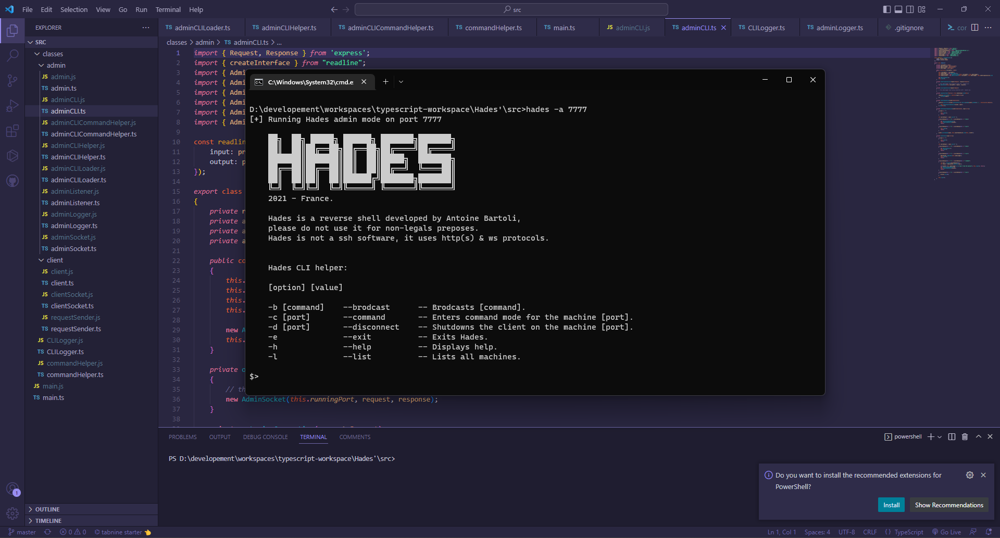

# Hades
Simple reverse shell CLI developed for education purposes.

This program is written in Typescript and is made to run with [Node.js](https://nodejs.org/). Some libraries are required, [see](#libs) the list of libraries used in this project.

<!-- Note that this program is compilable using , and the last version is compiled in the `./bin` directory. -->

## How to use

## Compile using Nexe
To compile from source, you will need to follow the instructions listed below.

1) [Transpile](https://code.visualstudio.com/docs/typescript/typescript-compiling) all `.ts` files into `.js`.
2) Install [Nexe](https://github.com/nexe/nexe).
3) Execute `nexe src/main.js -o bin/hades -t "linux-x64-14.15.3" -r "src/**.js"`.
4) Change `linux-x64` with the os you are using following by the [architecture of your CPU](https://linuxconfig.org/what-is-my-architecture-is-my-cpu-64-bit-or-32-bit#:~:text=The%20best%20way%20to%20quickly,default%20on%20all%20Linux%20distros.).

Note that the program is already compiled in the `./bin` directory.

## Libs
Here is the list of used libraries
- `Axios` - Used to send requests.
- `WSS` - Used for socket connections.
- `Express` - Used to setup servers.

<!-- ## Disclaimer ##
This repository is for academic purposes, the use of this software is your responsibility. -->